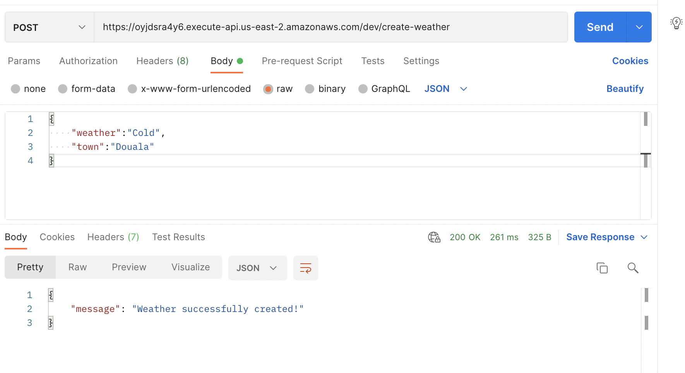
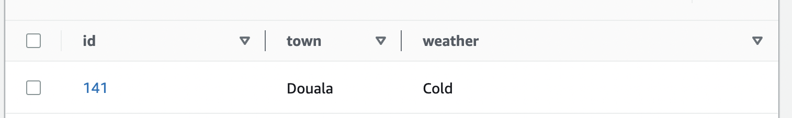

## Testing the Create Weather Endpoint
I'm assuming you've deployed and gotten the api gateway endpoint. 

Now, open up postman and paste the url into the url textfield.

The create weather path is /create-weather

Request is `POST`

Request body is

```json
{
  "weather": "Cold",
  "town": "Douala"
}
```
Be sure to choose `raw` and `json` as body formatters.



If you open up your dynamodb table in the aws console, you should see the created item there.



Go ahead and create more items in the dynamodb table.