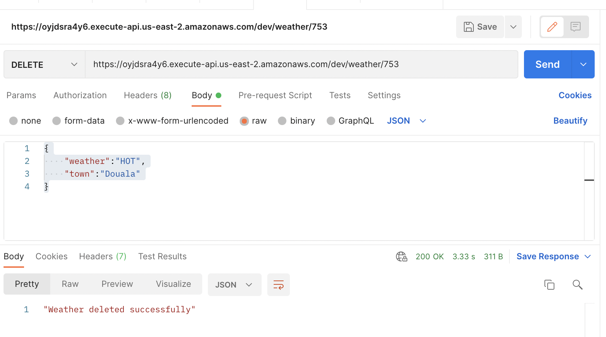

## Testing the Delete Weather Endpoint
Let's delete any item we created in the dynamodb table.

I'll pick any `id` of an item in my table and use.

Still in postman, change the path to /weather/753

Request is `DELETE`

