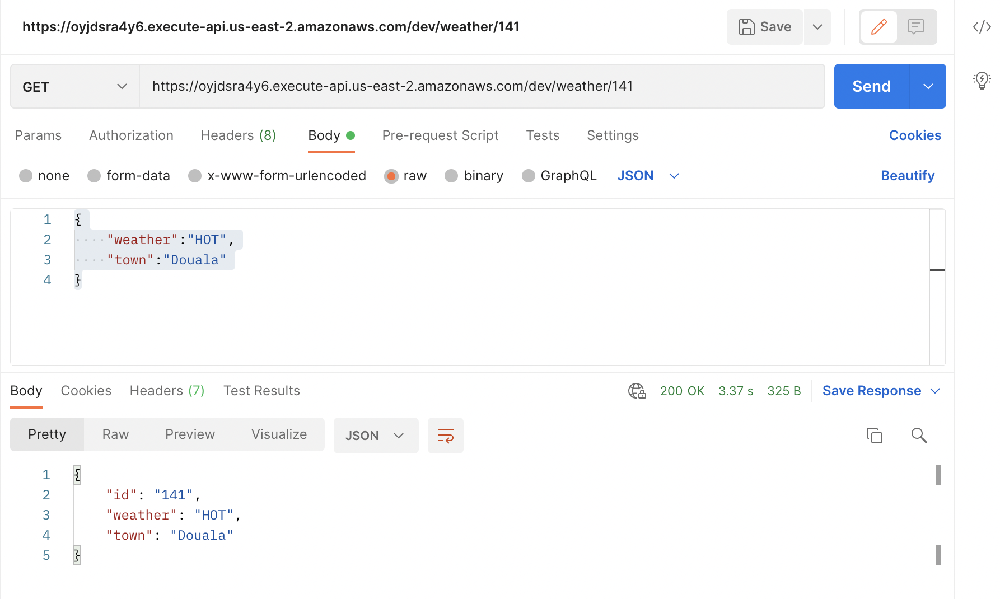

## Testing the get Weather Endpoint
Let's get the item we just created in the dynamodb table.

Still in postman, change the path to /weather/141

`141` is the id of the item i just created. I got that from the dynamodb table.

Please go to your dynamodb table and get the `id` of the item you created.

Request is `GET`

There isn't any request body

