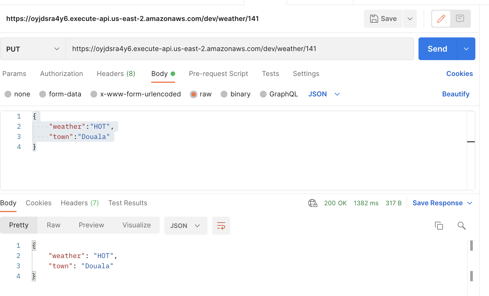

## Testing the Update Weather Endpoint
Let's update the item we just created in the dynamodb table.

Still in postman, change the path to /weather/141

`141` is the id of the item I just created. 

Request is `PUT`

Request body is
```json
{
  "weather": "HOT",
  "town": "Douala"
}
```
Be sure to choose `raw` and `json` as body formatters.


